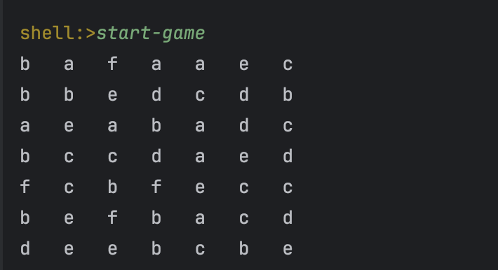
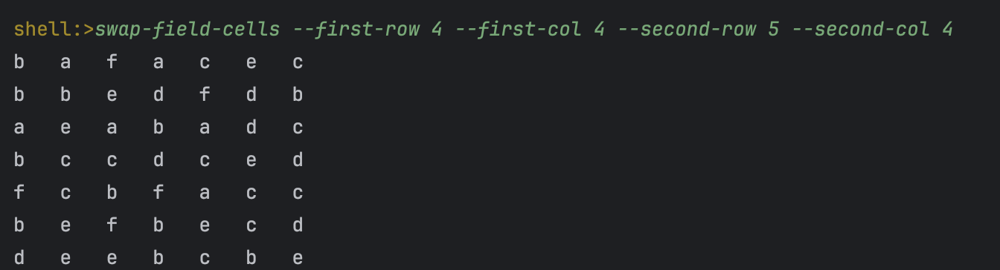
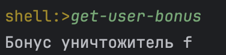
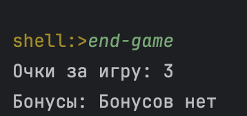

## Настройки
Для запуска проекта необходима Java 17+ и maven.
Выполните сборку в jar и запустите игру.

## Игра

Для начала игры необходимо выполнить команду start-game, после чего игроку будет показано первое поле

Чтобы выполнить ход игроку понадобится команда swap-field-cells, в которой надо отметить координаты нужных ячеек таким образом:
--first-row 1 --first-col 2 --second-row 3 --second-col 4

После хода игрока ему покажется уже модифицированное игровое поле

За 4 и более выбитых ячейки игрок может получить бонус, что этот бонус делает можно понять из названия)

Использовать же бонус можно с помощью команды: use-bonus-move **имя бонуса**

Чтобы завершить игру введите команду end-game и вам покажутся набранные очки и неиспользованные бонусы

Для перезапуска игры введите команду restart-game, но учтите, что все ваши очки и бонусы будут утеряны,
а поле сгенерировано заново
